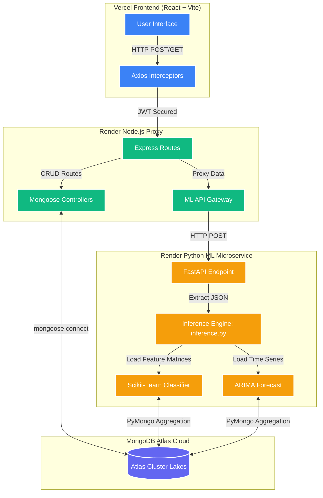

# 🚀 HabitForge: AI-Powered Habit Tracking Ecosystem

HabitForge is a next-generation, cloud-native habit tracking platform. Moving beyond simple MERN-stack operations, HabitForge employs a dedicated Python Machine Learning microservice built on FastAPI. It analyzes historical `HabitLog` tensors to calculate the statistical probability of a user completing a habit and generates predictive behavioral pipelines.

---

## 🧠 Machine Learning Engine Integration

HabitForge utilizes **two distinct machine learning techniques** isolated in their own high-speed Python architectural environment.

### 1. Classification (Daily Completion Prediction)
This framework determines exactly how likely a user is to complete a specific habit on the current algorithmic day.

*   **Technique:** Random Forest Classification / Scikit-Learn
*   **Vector Construction:** We extract MongoDB habit logs to engineer advanced temporal features on the fly. These matrices include: `rolling_7d_mean`, `current_streak`, `is_weekend`, `completion_hour_avg`, and `category_encoded`.
*   **Threshold Value Logic:** The Scikit-Learn model outputs a raw probability tensor between `0.0` and `1.0`.
    *   **Prediction Boundary:** If Probability `>= 0.5`, the model classifies it as **✓ Likely** (`will_complete`). Below `0.5`, it classifies as **✗ At Risk** (`will_miss`).
    *   **Confidence Weights:** 
        *   **High Confidence:** Probability `>= 0.8` or `<= 0.2`
        *   **Medium Confidence:** Probability `>= 0.65` or `<= 0.35`
        *   **Low Confidence:** Falls inside the `0.35` - `0.65` volatility range.

### 2. Time-Series Forecasting (7-Day Consistency Curve)
Instead of classifying a single binary outcome, this model projects global user consistency tracking forward in time.

*   **Technique:** Autoregressive Integrated Moving Average (ARIMA) / statsmodels
*   **Workflow:** The `data_loader.py` engine converts unevenly spaced daily completion metrics into a normalized uniform time series, bounding daily behavioral scores between `0.0` and `1.0`.
*   **Execution:** The unpickled `arima_model.joblib` extrapolates moving averages and seasonal inertia, returning an array of the next 7 days corresponding with mathematical confidence boundaries.

---

## 🏛️ Comprehensive Multi-Tier Architecture

---

## 🚀 Cloud Deployment Variables

To host your own version of the HabitForge ecosystem, inject the following strict Environment Variables:

### 1. Vercel (Frontend)
- `VITE_API_URL`: The exact URL of the deployed Node.js backend.

### 2. Render Node.js (Backend)
- `MONGO_URI`: The MongoDB Atlas string containing the target database (`...mongodb.net/habitforge?...`).
- `ALLOWED_ORIGINS`: The deployed Vercel URL to restrict CORS blockages.
- `JWT_SECRET`: Secure cryptographic hash string.
- `ML_API_URL`: The isolated URL of the deployed Python FastAPI ML Service.

### 3. Render Python (ML Service)
- `MONGO_URI`: Identical Atlas string to extract prediction vectors.
- `PYTHON_VERSION`: `3.10.0` or higher to stabilize the `scikit-learn` memory architecture.

---

## 📂 Local Development

Clone the monorepo and navigate to the respective folders to spin up the local environment.

**Frontend:**
\`\`\`bash
cd frontend
npm install
npm run dev
\`\`\`

**Backend:**
\`\`\`bash
cd backend
npm install
npm start
\`\`\`

**ML Service:**
\`\`\`bash
cd ml-service
python -m venv .venv
source .venv/bin/activate
pip install -r requirements.txt
python api.py
\`\`\`
